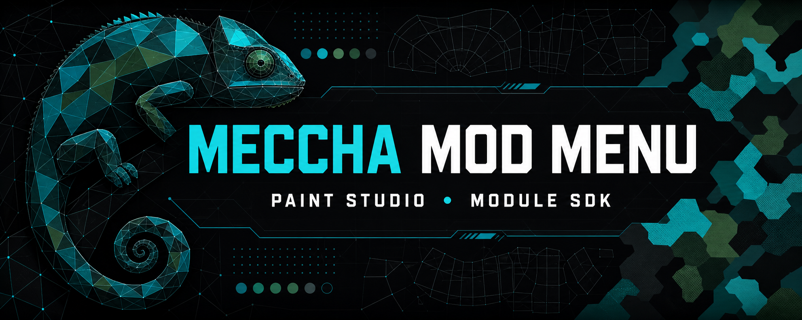

<p align="center">
  
</p>

<h1 align="center">Meccha Mod Menu</h1>

<p align="center">
  An unofficial, extensible Windows mod menu for <strong>MECCHA CHAMELEON</strong>.
</p>

> [!IMPORTANT]
> Meccha Mod Menu is an unofficial modified build based on
> [Meccha Camouflage](https://github.com/acentrist/MecchaCamouflage). It is not
> an official MECCHA CHAMELEON tool and is not endorsed by the upstream project.

## Features

- **Auto Paint** — reproduces the current camouflage with coarse, fine, and
  adaptive-detail passes.
- **50–500% detail resolution** — defaults to 500% and scales native adaptive
  refinement up to a real 2,560-stroke budget.
- **Paint Studio** — saves presets, previews and restores paint, undoes the last
  settings change, and shows planned coverage.
- **Module SDK v1** — loads trusted local Web modules through validated
  manifests, isolated origins, and explicit paint, network, persistent-storage,
  and session-memory permissions.
- **MECCHA CHAMELEON update2.8.0 support** — the current native runtime target.

## Build and run

Packaged releases are not available yet. To build the current version, use
64-bit Windows 10 or 11 with the .NET 10 SDK, Windows SDK, and Visual Studio
2022 Build Tools with the Desktop C++ toolchain:

```powershell
git clone https://github.com/Coolythecoder/MecchaModMenu.git
cd MecchaModMenu
.\scripts\build.ps1 -BuildMode DevLooseSelfContained -Version 0.0.0-dev -ShowTimings
.\.build\bin-dev\meccha-mod-menu.exe
```

The first build may download NuGet packages and the official Microsoft
WebView2 Evergreen bootstrapper. To make a single-file build and package:

```powershell
.\scripts\build.ps1 -Version 0.0.0-dev -ShowTimings
.\scripts\release.ps1 -Version 0.0.0-dev
```

The single-file build is written to `.build\bin\meccha-mod-menu.exe`, and the
packaged executable is written to
`.build\package\meccha-mod-menu-0.0.0-dev.exe`.

## Using the mod menu

1. Start MECCHA CHAMELEON.
2. Start `meccha-mod-menu.exe`.
3. Confirm that the selected game process and native bridge are connected.
4. Open **Auto Paint** to configure the brushes, regions, material, pacing, and
   detail resolution.
5. Use **Paint Studio** for presets, preview/restore, undo, and coverage details.

Settings, logs, and module packages remain under
`%LOCALAPPDATA%\MecchaCamouflage\` for compatibility with existing installs.

## Make your own module

A module is a local folder containing a strict `module.json` manifest and an
HTML entry point. It does not need a compiler or separate server.

### 1. Create the package

Create this directory structure:

```text
%LOCALAPPDATA%\MecchaCamouflage\modules\my-first-module\
├── module.json
└── index.html
```

The folder name must match the manifest `id`.

The HTML entry must be UTF-8 and contain an explicit `<head>` before any
executable markup. The host serves an isolated runtime snapshot and injects
UTF-8, no-referrer, and host-owned security metadata at the start of
that head before the document runs.

Reference packaged scripts, styles, images, and other assets with relative URLs
such as `./module.js` or `assets/icon.png`. Do not use root-relative `/...`
URLs. Each reload generation has its own entry-path prefix, and relative URLs
retain that prefix so the fresh validated snapshot is not shadowed by cached
assets from an earlier generation.

### 2. Add `module.json`

```json
{
  "schema_version": 1,
  "api_version": 1,
  "id": "my-first-module",
  "name": "My First Module",
  "version": "1.0.0",
  "description": "Reads the current sanitized paint snapshot.",
  "entry": "index.html",
  "permissions": ["snapshot.read"]
}
```

Module IDs must start with a lowercase ASCII letter and may contain lowercase
letters, digits, `.`, `-`, and `_`. Consecutive or trailing separators are not
accepted. The ID is limited to 64 characters. `description` and `permissions`
are optional; all other properties shown above are required.

### 3. Add `index.html`

```html
<!doctype html>
<html lang="en">
<head>
  <meta charset="utf-8">
  <meta name="viewport" content="width=device-width, initial-scale=1">
  <title>My First Module</title>
</head>
<body>
  <button id="refresh" type="button">Read paint snapshot</button>
  <pre id="output">Waiting for the host…</pre>

  <script>
    const hostOrigin = "https://meccha.localhost";
    const output = document.getElementById("output");

    function request(command, payload = {}) {
      window.parent.postMessage({
        source: "meccha-module",
        apiVersion: 1,
        requestId: crypto.randomUUID(),
        command,
        payload
      }, hostOrigin);
    }

    window.addEventListener("message", event => {
      if (event.origin !== hostOrigin) return;
      if (event.data?.source !== "meccha-host") return;
      if (event.data?.apiVersion !== 1) return;

      if (event.data.type === "response") {
        output.textContent = JSON.stringify(event.data, null, 2);
      }
      if (event.data.type === "event" && event.data.name === "snapshotChanged") {
        output.textContent = JSON.stringify(event.data.data, null, 2);
      }
    });

    document.getElementById("refresh").addEventListener("click", () => {
      request("snapshot.get");
    });
  </script>
</body>
</html>
```

The host responds only to the registered module frame. Always validate
`event.origin`, `source`, and `apiVersion` before using a message.
Payload shapes are command-specific. Paint commands ignore their payload and use
the settings currently configured in Meccha Mod Menu.

### 4. Choose permissions

Only declare permissions your module uses:

| Permission | Allowed request |
| --- | --- |
| `snapshot.read` | `snapshot.get` and sanitized `snapshotChanged` events |
| `paint.start` | `paint.start` |
| `paint.preview` | `paint.preview` |
| `paint.restore` | `paint.restore` |
| `paint.stop` | `paint.stop` |
| `storage.read` | `sdk.storage.get` and `sdk.storage.list` for persistent module data |
| `storage.write` | `sdk.storage.set` and `sdk.storage.delete` for persistent module data |
| `memory.read` | `sdk.memory.get` and `sdk.memory.list` for this app session |
| `memory.write` | `sdk.memory.set` and `sdk.memory.delete` for this app session |

There is no generic native-command, filesystem, or process permission. Paint
actions use the current settings configured in Meccha Mod Menu. All accepted
modules have broad HTTP, HTTPS, WS, WSS, `fetch`, XHR, EventSource,
`navigator.sendBeacon()`, and hyperlink `ping` access without a network manifest
permission. For a network-only module, this is valid:

```json
"permissions": []
```

Module JavaScript can use the standard browser APIs directly:

```js
const response = await fetch("https://api.example.com/paint");
const data = await response.json();

const socket = new WebSocket("wss://api.example.com/live");
socket.addEventListener("message", event => console.log(event.data));

const queued = navigator.sendBeacon(
  "https://api.example.com/session-end",
  JSON.stringify({ reason: "module-hidden" })
);
```

Beacon and hyperlink `ping` are fire-and-forget POST requests: responses are not
exposed to the module, and a `true` `sendBeacon()` result means queued rather
than delivered.

The remote server must allow the module's origin for CORS and WebSocket Origin
checks. Use `location.origin` to see the module's isolated origin; do not assume
it is `https://meccha.localhost`. Plaintext HTTP and WS are enabled, but they are
neither private nor tamper-resistant. Prefer HTTPS and WSS.

All modules share the app's WebView profile. Their unrelated `*.localhost`
origins remain separate, but a credentialed request can use cookie or
authentication state held for the remote target domain, including state used by
another module. CORS controls whether JavaScript may read a cross-origin
response; it is not a guarantee that the request was never sent. Remote servers
must enforce authorization and CSRF protections independently.

For module-owned JSON data, copy the Promise-based `sdk` wrapper from the full
guide. `sdk.storage` persists across reloads and app versions; `sdk.memory`
survives module reloads only within the current app process:

```js
await sdk.storage.set("preferences", { accent: "#5ac8fa" });
const preferences = await sdk.storage.get("preferences");

await sdk.memory.set("preview", { selected: 3 });
const sessionKeys = await sdk.memory.list();
```

Both namespaces are per-module, quota-limited key/value stores. “Memory” means
volatile SDK data only—it never exposes game memory, process addresses, pointers,
or the native bridge.

### 5. Load and test it

1. Open Meccha Mod Menu and go to **App → External modules**.
2. Choose **Open folder** if you need the modules directory.
3. Copy your package into that directory.
4. Choose **Reload modules**.
5. Fix any catalog diagnostic shown for a rejected manifest or package.

Start from the bundled
[`docs/module-sdk/example`](docs/module-sdk/example/) package and read the full
[`Module SDK v1 guide`](docs/module-sdk/README.md) for the response protocol,
snapshot shape, validation rules, and trust model.

### Module package rules

- The entry must be a relative `.html` path contained inside the package.
- Symbolic links, reparse points, escaping paths, unknown manifest properties,
  duplicate IDs, and unknown or duplicate permission values are rejected. A
  command whose permission was not declared receives `permission_denied`.
- `module.json` is limited to 64 KiB. A package may contain up to 256 files and
  128 subdirectories, with a total size up to 32 MiB. Individual assets are
  limited to 8 MiB and the HTML entry to 4 MiB.
- Broad network access covers connection APIs only. Remote scripts and images,
  file access, form submissions, workers, and plug-ins remain blocked; keep
  those resources inside the validated module package.
- Package asset references must be relative rather than root-relative so they
  stay under the current reload generation's cache-busting path.
- Persistent storage is plain local JSON namespaced by module ID, not a secret vault.
  Replacing a package with another package using the same ID retains that data.
- Install only modules you trust. Permission checks and browser isolation reduce
  accidental access but do not make untrusted local code safe.

## Development references

- [Repository layout](docs/repository-layout.md)
- [Module SDK v1](docs/module-sdk/README.md)
- [Direct bridge design](docs/runtime-direct-bridge.md)
- [Runtime maintenance](docs/runtime-maintenance.md)
- [Paint replication validation](docs/runtime-paint-replication-validation.md)
- [Release checklist](docs/release-checklist.md)

Run the same build pipeline used by CI:

```powershell
.\scripts\build.ps1 -Version ci-local -ShowTimings
.\scripts\release.ps1 -Version ci-local
```

## License and credits

Meccha Mod Menu is distributed under GPL-3.0-or-later. It is based on
[acentrist/MecchaCamouflage](https://github.com/acentrist/MecchaCamouflage).
See [LICENSE.txt](LICENSE.txt) and [BRANDING.md](BRANDING.md) for the license,
copyright, and attribution notices.
