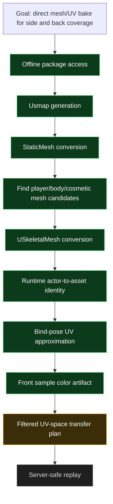

# Agent Research State

This note is for future agent turns. Keep it factual and update it when the research state changes.

## Status Graph



## Verified Facts

- The upstream prebuilt `UnrealMappingsDumper.dll` crashed the game and must not be reused.
- The local patched dumper source builds and can generate `.build\research\mappings\Mappings.usmap` without crashing the game.
- Latest successful dump:
  - UE version guess: `5.6`
  - `GObjects` accepted
  - `FNameToString` accepted
  - `UObject`: `Class=0x10`, `Name=0x18`, `Outer=0x20`
  - `UStruct`: `Super=0x40`, `ChildProperties=0x50`
  - `FField`: `ClassPrivate=0x8`, `Next=0x18`, `Name=0x20`, `Flags=0x28`
  - `FProperty.ArrayDim=0x30`
  - `FStructProperty.Struct=0x70`
  - `FByteProperty.Enum=0x70`
  - `FArrayProperty.Inner=0x78`
  - `FSetProperty.Element=0x70`
  - `FMapProperty.Key=0x70`, `FMapProperty.Value=0x78`
  - `FEnumProperty.Underlying=0x70`, `FEnumProperty.Enum=0x78`
  - `10807` structs, `37740` serializable properties
  - nested-property fallback count: `0`
- Latest asset probe:
  - exe SHA-256: `c7547bcd42a6b72e26c5412ecfd0a52008772bde8e42eb6db8cadc6106d38e21`
  - usmap SHA-256: `91269446c657ce359deb6eedd93e53d9dfa4c20d067359a473fee3e0dc82011e`
  - mounted with `GAME_UE5_6`
  - scanned `5511` packages
  - found `805` StaticMesh exports
  - found `16` SkeletalMesh exports
  - converted `16` SkeletalMeshes
  - exported `10` top SkeletalMesh LOD0 geometry JSON files under `.build\research\mesh_exports\`
  - top candidates:
    - `paintman`: `1660` vertices, `8352` indices, `28` bones, 1 UV channel
    - `santapengun`: `4728` vertices, `23712` indices, `40` bones, 1 UV channel
    - `SK_LINK_Penguin`: `3468` vertices, `18624` indices, `40` bones, 1 UV channel
    - `pengun`: `4042` vertices, `17856` indices, `34` bones, 1 UV channel
  - `paintman` geometry JSON includes vertex position, normal, UV, bone influence, indices, and reference bones.
- Runtime actor-to-asset identity is confirmed for the latest paint run:
  - runtime source: `runtime_paint_get_initialized_paint_mesh`
  - component: `BP_FirstPersonCharacter_cLeon_Character_C.Mesh`
  - component class: `SkeletalMeshComponent`
  - asset: `/Game/3Dmodel/cLeon/charactor/paintman/skeltal/paintman.paintman`
  - offline package: `Chameleon/Content/3Dmodel/cLeon/charactor/paintman/skeltal/paintman.uasset`
  - export: `paintman`
- `paintman` LOD0 has `1660` vertices, `8352` indices, `2784` triangles, `28` bones, one material slot, and UV0 range approximately `U 0.000938..0.999023`, `V 0.041077..0.999023`.
- `tools/mesh_planner` can emit a bind-pose UV plan for `paintman`. Latest run classified `2784` triangles as `564` front, `1640` side, and `580` back, producing `3117` side/back target UV samples from the latest camera direction.
- Setting `MECCHA_RESEARCH_ARTIFACTS=1` before `make run` makes the bridge write a generated `*.front_samples.json` sidecar with front UV/color samples. `run-mesh-planner.ps1` auto-detects the newest sidecar and colorizes target samples by nearest UV source.
- Latest colorized planner run:
  - front samples: `20029`
  - target samples: `3105`
  - target split: `2383` side, `722` back
  - nearest-source UV distance: p50 `0.017271`, p90 `0.155525`, p95 `0.197603`, p99 `0.280566`, max `0.317105`
  - conclusion: colorized plan generation works, but raw nearest-UV transfer is too loose for some samples; add distance thresholds and UV-island/region constraints before replaying side/back strokes.
- `make build`, `make package`, `git diff --check`, mapping dumper build, and asset probe build passed after adding the research tree.
- CUE4Parse currently reports `Microsoft.Bcl.Memory 9.0.0` NU1903 warnings. This is in the research dependency path, not the runtime package.

## Current Sampling Workflow

The sampling workflow has shifted from "generate more runtime hit-test samples" to a two-source workflow:

1. Runtime front pass still uses the existing hit-test and scene-capture path. It produces reliable visible-surface UV/color samples and sends the normal front paint strokes.
2. With `MECCHA_RESEARCH_ARTIFACTS=1`, the bridge also writes those front UV/color samples as a generated `*.front_samples.json` sidecar.
3. Offline mesh planner loads the confirmed `paintman` LOD0 geometry, classifies bind-pose triangles with the latest camera direction, and emits side/back UV targets.
4. Offline planner colorizes side/back targets from the nearest front sample. This is only a planning artifact right now.
5. Before replay, the planner needs filters for nearest-source UV distance and UV-island/region consistency. Raw nearest-neighbor transfer is not safe enough yet.
6. Only filtered targets should be considered for a conservative server replay path.

This means v1 direct bake should probably not replace the existing front paint workflow. It should extend it: front runtime sampling remains the source of truth for visible color, while mesh/UV planning decides optional side/back expansion.

## Do Not Redo

- Do not try the upstream prebuilt dumper again.
- Do not re-debug `ChildProperties` / `FProperty` layout unless a game update or new dump log invalidates the current offsets.
- Do not commit generated `.usmap`, game archives, crash dumps, logs, injected DLLs, or build outputs.
- Do not commit `.front_samples.json`, `.uv-plan*.json`, or exported mesh geometry JSON from `.build\research`.
- Do not move CUE4Parse into the runtime build. It is research-only.

## Safe Commands

```powershell
git submodule update --init --recursive
.\scripts\research\build-asset-probe.ps1
.\scripts\research\build-mapping-dumper.ps1
.\scripts\research\inject-mapping-dumper.ps1 -Mode Probe
.\scripts\research\inject-mapping-dumper.ps1 -Mode ObjectScan
.\scripts\research\inject-mapping-dumper.ps1 -Mode Dump
.\scripts\research\run-asset-probe.ps1 -UsmapPath .build\research\mappings\Mappings.usmap -GameVersion GAME_UE5_6 -PackageLimit 1000 -AllowFailure
.\scripts\research\run-asset-probe.ps1 -UsmapPath .build\research\mappings\Mappings.usmap -GameVersion GAME_UE5_6 -PackageLimit 13000 -ExportTopSkeletal 10 -AllowFailure
.\scripts\research\run-mesh-planner.ps1
```

Only inject a newly built DLL once per mode. Use `-Force` only intentionally.

## Stop Rules

- Stop immediately after a real game crash.
- Stop after two consecutive guarded dump failures with the same symptom.
- Stop if `Probe` cannot validate `GObjects` or `FNameToString`.
- Stop if the generated mapping has `total_props=0`, has nested-property fallback spikes, or CUE4Parse no longer converts a known StaticMesh.
- In any stop case, update this file and `docs/research/mappings.md` with the new blocker before continuing.

## Next Work

1. Add planner filters for nearest-source UV distance and UV-island/region constraints.
2. Re-run colorized planning and inspect dropped/kept sample counts by `side` and `back`.
3. Add a small summary to the planner output: kept count, dropped-by-distance count, max accepted distance, and candidate replay stroke count.
4. If the filtered offline transfer looks sane, prototype a server-safe replay path using only saved/effective tuning and conservative batch pacing.
5. Do not touch runtime/server paint execution until the filtered colorized plan is reviewed.
